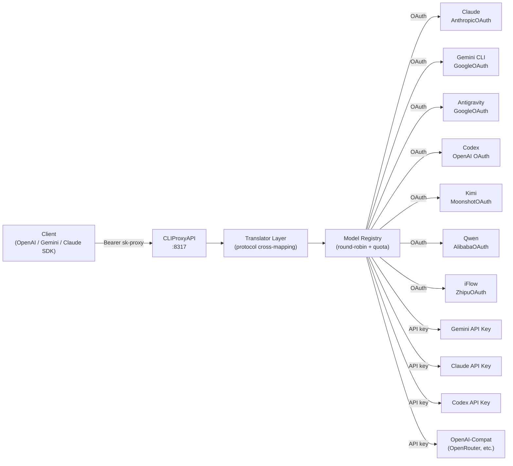

# CLIProxyAPI

> **Deprecation notice:** This project is being superseded by orchestratorv2. Active deployments should plan migration.

Multi-provider AI proxy exposing OpenAI/Gemini/Claude-compatible HTTP endpoints with multi-account round-robin, quota fallback, and 86 static model definitions across 9 provider channels.

Port: **8317** | Auth dir: `~/.cli-proxy-api`



## Quick Start

```bash
# Build
go build -o ./cli-proxy-api ./cmd/server/

# Configure
cp config.example.yaml config.yaml
# Edit: port, api-keys, provider credentials

# Run
./cli-proxy-api --config config.yaml

# OAuth login (one-time per provider)
./cli-proxy-api --login              # Gemini CLI
./cli-proxy-api --claude-login       # Claude OAuth
./cli-proxy-api --codex-login        # Codex OAuth
./cli-proxy-api --kimi-login         # Kimi OAuth
./cli-proxy-api --qwen-login         # Qwen OAuth

# Test
curl http://127.0.0.1:8317/v1/models -H "Authorization: Bearer sk-proxy"
```

## Technology Stack

| Component            | Technology                                          |
| -------------------- | --------------------------------------------------- |
| Language             | Go 1.26                                             |
| HTTP framework       | Gin                                                 |
| Config               | YAML (gopkg.in/yaml.v3)                             |
| Protocol translation | Custom translator registry (init-time registration) |
| Model registry       | In-memory, reference-counted, RWMutex               |
| OAuth                | golang.org/x/oauth2 + uTLS fingerprinting           |
| Streaming            | SSE + gorilla/websocket relay                       |
| Token counting       | tiktoken-go                                         |
| JSON path            | gjson/sjson                                         |
| Logging              | logrus + lumberjack rotation                        |
| Container            | Docker (alpine:3.22, port 8317)                     |

## Providers & Model Counts

| Provider         | Auth type       | Channel key                        | Static models |
| ---------------- | --------------- | ---------------------------------- | ------------- |
| Anthropic Claude | OAuth + API key | `claude`                           | 9             |
| Google Gemini    | OAuth + API key | `gemini`, `gemini-cli`, `aistudio` | 6 + dynamic   |
| Google Vertex    | OAuth + API key | `vertex`                           | 4             |
| OpenAI Codex     | OAuth + API key | `codex`                            | ~14           |
| Kimi (Moonshot)  | OAuth           | `kimi`                             | 4             |
| Qwen (Alibaba)   | OAuth           | `qwen`                             | 4             |
| iFlow (Zhipu)    | OAuth           | `iflow`                            | 25+           |
| Antigravity      | Google OAuth    | `antigravity`                      | config-driven |
| OpenAI-compat    | API key         | `openai-compatibility`             | user-defined  |
